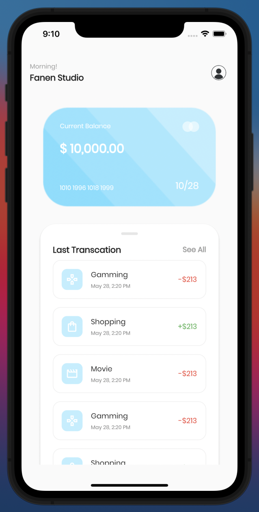
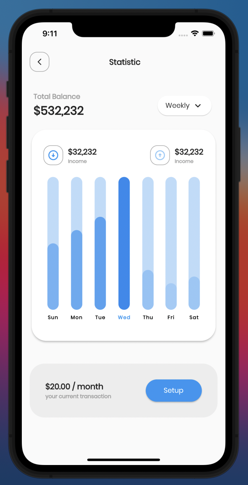

# UI KIT B-Wallet

🔥 This is a Design to Code Booking Hotel app built with Flutter framework

## 📸 Screenshot

<pre>
          
</pre>

## Modularization Structure 🔥

    # Root Project
    .
    ├── assets
    ├── lib                    
        ├── bar_widget                    
        ├── custom_appbar                    
        ├── home_screen                    
        ├── main                    
        ├── statistic_screen                    
        ├── transfer_screen          
     
     

## Finished
* [x] Modular the project based on the functionality

## Author

* **Muhamad Alamsyah**

Don't forget to follow me, fork and give me a ⭐

## License

[Muhamad Alamsyah](https://github.com/alamsyahh15)
